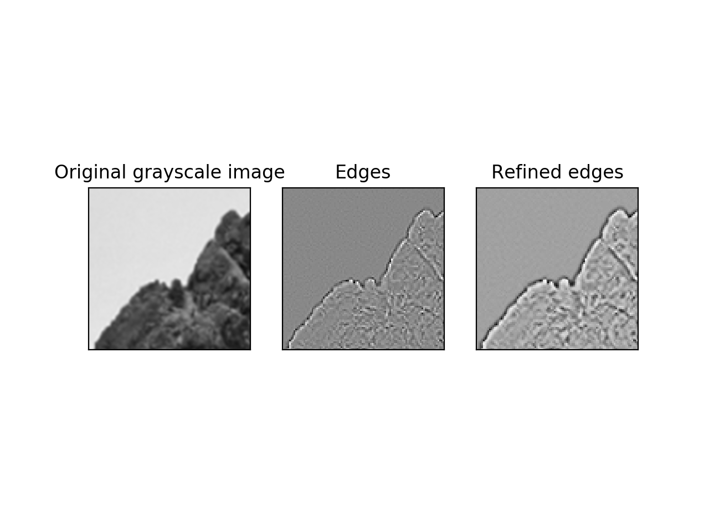
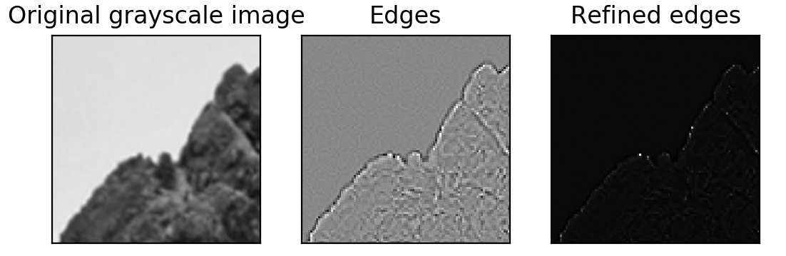

# relax: 💤 relaxation Labelling to refine edge detection 💤.

This is an application of a niche algorithm named relaxation labeling to refine edge detection probabilities.

In the normal formulation relaxation is stated as a labelling problem. For an image we may wish to label each pixel as belonging to an edge, or being part of a region.

For example, we would normally have pixels as the objects, and the labels could be 'edge' or 'not edge'. Associated with each `a_i` is a set of measurements `X_i`, and also associated with each `a_i` is the contextual information of the other objects, which will depend on the current labels. Ideally, we would like to assign each object one label, but this will not in general be possible, and so we will have, for each object a set of probabilities of each label that logically sum to 1.

The contextual information is expressed by compatibility coefficients:

`r([a_i:l_j], [a_k:l_l])`

The value of r is a measure of how compatible it would be to label `a_i` with `l_j` and `a_k` with `l_l`. There will be one compatibility coefficient for each possible labelling of each pair of objects in the set.

It is an iterative process by defining compatibility coefficients and the region it is possible to refine the edge probabilities converted from intensities.

If you want to read more about it, here is a source better describing what is going on: [Link](http://users.cs.cf.ac.uk/Dave.Marshall/AI2/node188.html)

This work was completed in **October 2017**.

## Building and Running
To install all the dependencies run:

`pip install -r requirements.txt`

Then you can just do e.g.:

```bash
python3 relax.py -d imgs/test.png -o test1.png -i 3 -c 2 0.5 0.5 2 -s 3 -v 1
-d Data input
-o Data output
-i Number of iterations
-c Compatibility matrix
-s Shape of the region matrix
-v Visualize the result
```
and voila!



Or a different compatibility matrix and a shape produces:

```bash
python3 relax.py -d imgs/test.png -o test2.png -i 3 -c 2 0.5 0.5 0.5 -s 5 -v 1
```



## Credits
All done by Martin Ferianc, 2017.
